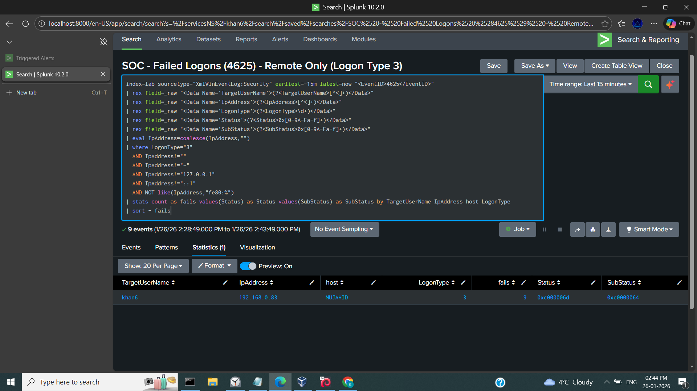
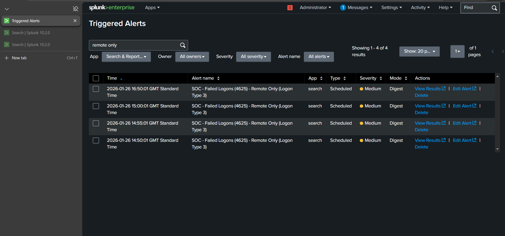
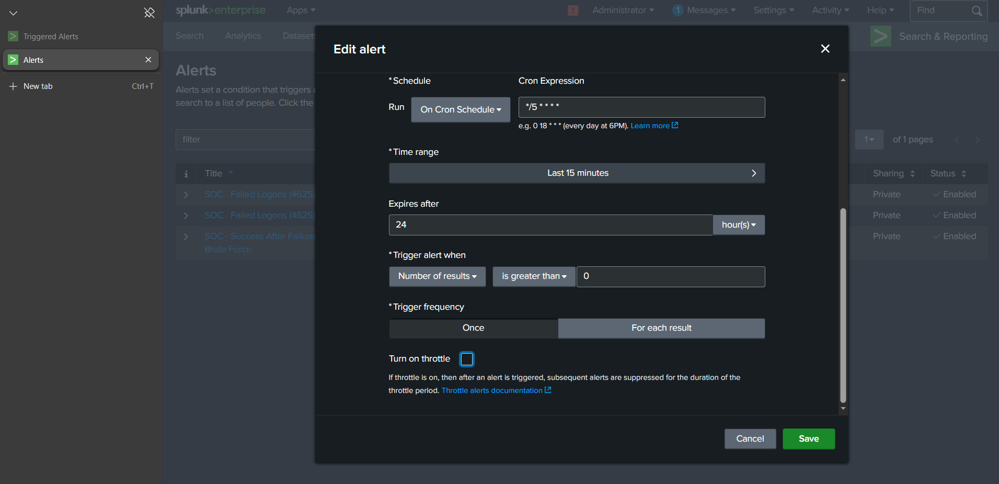

# SOC Detection Engineering — Splunk SIEM
## Windows Remote Failed Logon Detection (Event ID 4625 — Logon Type 3)

### Overview
This repository documents a SOC detection engineering project implemented in Splunk SIEM to detect **remote authentication failures** on Windows systems.

This detection targets **Event ID 4625 (failed logon)** with **Logon Type 3 (network logon)**, commonly associated with:
- Brute-force attempts
- Password spraying
- Unauthorized remote access / lateral movement attempts

### Detection Objective
- Detect suspicious remote authentication failures
- Reduce false positives caused by local/system activity
- Provide actionable context to analysts (user, source IP, host, failure codes)
- Support consistent triage via a documented runbook

- ### MITRE ATT&CK Mapping
- **T1110** — Brute Force
- **T1078** — Valid Accounts

### Environment
| Component | Details |
|---|---|
| SIEM | Splunk Enterprise |
| Log Source | Windows Security Logs |
| Sourcetype | XmlWinEventLog:Security |
| Index | lab |
| Alert schedule | Every 5 minutes |
| Lookback window | Last 15 minutes |
| Threshold | fails ≥ 5 |
| Throttle | 30 minutes |
| Severity | Medium |

### Detection Logic Summary
- Filter to EventID 4625
- Extract fields from XML (`TargetUserName`, `IpAddress`, `LogonType`, `Status`, `SubStatus`)
- Keep **remote** failures only (`LogonType=3`)
- Exclude noisy sources (loopback, IPv6 loopback/link-local, empty IP)
- Aggregate fails by user/IP/host
- Alert if fails ≥ 5 in the window
## Detection Evidence

### SPL Search Results

### Triggered Alerts

### Alert Configuration

### Repository Contents
- `detections/` — SPL detection logic
- `runbooks/` — SOC mini runbook (triage notes)
- `screenshots/` — evidence of alerting working in Splunk
- `notes/` — planned enhancements

## Incident Response Runbook

A mini SOC runbook was created for analyst triage and investigation.

📄 Runbook:
- [4625 Remote Failed Logons Runbook](runbooks/4625_remote_failed_logons_runbook.pdf)

### Validation Evidence
See screenshots in `screenshots/`:
- `spl_search_results.png`
- `alert_configuration.png`
- `triggered_alerts.png`

### Future Improvements
See: `notes/future_improvements.md`
